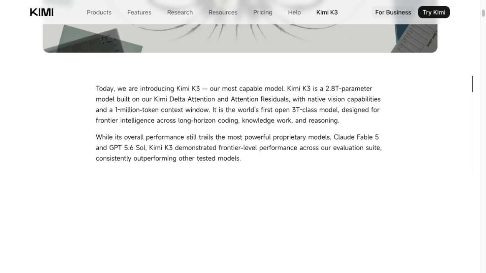
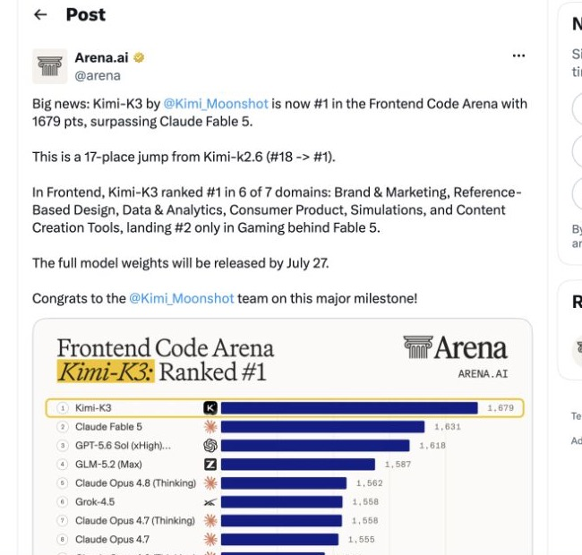

2026 年 7 月 16 日，月之暗面发布了 Kimi K3。

在看到发布信息之前，我一直觉得，下一阶段开放模型的规模门槛大概会落在 1T 到 1.5T。这个判断并不来自某条经过证明的定律，而是来自过去一年公开模型呈现出的趋势：Kimi K2.6 已经达到 1T，DeepSeek V4 Pro 和 LongCat 2.0 来到 1.6T。能否训练并部署一个万亿参数级的 MoE，看起来越来越像一家基础模型公司继续留在前沿竞争中的船票。

所以 K3 最先让我意外的不是榜单，而是 2.8T。

相比 K2.6，它的总参数容量扩大到 2.8 倍；即使与此前公开的 1.6T 代表模型相比，也增加了 75%。这已经不是沿着原有区间向前走一步，而是直接把公开可见的规模坐标推到了另一个位置。

随后公布的成绩又说明，这次扩展没有只停留在配置表里。K3 在独立综合评测中进入了 GPT-5.6 Sol、Claude Fable 5 所在的能力区间，也略微越过 Claude Opus 4.8。

这让我重新考虑一个问题：K3 是否说明 Scaling 仍然是基础模型能力增长的主线，以及下一阶段真正的规模门槛可能比我原来想的更高？

本文记录的是我在 2026 年 7 月 18 日能够形成的判断。此时 K3 的产品和 API 已经上线，完整权重与技术报告计划最晚在 7 月 27 日发布；激活参数量、训练 Token 数和训练计算量仍未公开。

*来源：[Kimi K3 官方发布页](https://www.kimi.com/blog/kimi-k3)，截图于 2026 年 7 月 18 日。*

## 我为什么原来把 1T—1.5T 当成船票

把模型规模与当前综合成绩放在一起，K3 出现前后的变化会更直观。下面选取的是与本文问题直接相关的代表性模型，并非完整排行榜；综合分数采用 Artificial Analysis 在对应模型页记录的相应推理档位。

| 模型 | 类型 | 总参数量 | 激活参数量 | Intelligence Index |
| --- | --- | ---: | ---: | ---: |
| Claude Fable 5 | 国外闭源 | 未公开 | 未公开 | 60 |
| GPT-5.6 Sol Max | 国外闭源 | 未公开 | 未公开 | 59 |
| **Kimi K3** | **国产、计划开放权重** | **2.8T** | **未公开** | **57** |
| Claude Opus 4.8 | 国外闭源 | 未公开 | 未公开 | 56 |
| GLM-5.2 Max | 国产开放权重 | 753B | 40B | 51 |
| Qwen3.7 Max | 国产闭源 | 未公开 | 未公开 | 46 |
| Kimi K2.6 | 国产开放权重 | 1T | 32B | 44 |
| DeepSeek V4 Pro | 国产开放权重 | 1.6T | 49B | 44 |
| LongCat 2.0 | 国产开放权重 | 1.6T | 约 48B | — |

综合成绩记录自 2026 年 7 月 18 日的 [Artificial Analysis 模型榜单](https://artificialanalysis.ai/leaderboards/models/)、[K3 模型页](https://artificialanalysis.ai/models/kimi-k3)和 [Qwen3.7 Max 模型页](https://artificialanalysis.ai/models/qwen3-7-max/)。参数来自 [K3 官方发布文章](https://www.kimi.com/blog/kimi-k3)、[GLM-5.2](https://huggingface.co/zai-org/GLM-5.2)、[Kimi K2.6](https://huggingface.co/moonshotai/Kimi-K2.6)、[DeepSeek V4 Pro](https://huggingface.co/deepseek-ai/DeepSeek-V4-Pro)和 [LongCat 2.0](https://huggingface.co/meituan-longcat/LongCat-2.0-FP8)的公开页面。

这张表并不能证明 1T 是能力门槛。GLM-5.2 只有 753B 总参数，却明显领先几个更大的开放模型。参数量既不是进入前沿的充分条件，也不是严格的必要条件。

我原来的判断更接近一种产业观察：当公开模型陆续集中到 1T—1.6T，这个区间代表的不只是参数，也代表一家团队有没有足够的算力、资金、训练稳定性和集群调度能力，把一次大规模预训练真正变成可用产品。

因此，称它为“船票”多少带有简化。更准确地说，1T—1.6T 是 K3 之前公开可见的前沿工程区间，而不是研究界公认的一条分界线。K3 的 2.8T，让这个区间第一次显得可能还不够大。

## 2.8T 支持了什么，又不能证明什么

K3 是一个稀疏 MoE：总计 896 个专家，每个 Token 选择其中 16 个参与计算。2.8T 因而表示模型的总参数容量，不表示每生成一个 Token 都会激活 2.8T 参数。

总容量仍然有意义。更大的专家池可以容纳更多知识和更细的能力分工，但它也会增加路由、负载均衡和训练稳定性的难度。K3 同时引入 Kimi Delta Attention、Attention Residuals、Stable LatentMoE 和量化感知训练等方法，目的正是让更大的模型能够被训练，并以可接受的成本处理 100 万 Token 上下文。[Kimi Delta Attention](https://github.com/MoonshotAI/Kimi-Linear)和 [Attention Residuals](https://github.com/MoonshotAI/Attention-Residuals)此前已经分别公开过研究与实验结果。

从结果看，我认为 K3 是一个很强的公开信号：2.8T 的规模扩张与能力跃迁同时出现，说明继续扩大基础模型仍是一条有生产力的路线；至于规模单独贡献了多少，目前还无法回答。

但 K3 还不能严格证明“参数越多就是越强”。经典 [Scaling Laws](https://arxiv.org/abs/2001.08361) 讨论的是模型规模、数据规模和训练计算量之间的共同关系；[Chinchilla](https://arxiv.org/abs/2203.15556)则说明，在固定计算预算下，参数量和训练 Token 需要一起增长。K3 目前没有公布训练 Token、训练 FLOPs 和同配方消融实验，我们无法把这次提升拆分成参数、架构、数据和后训练各自贡献了多少。

GLM-5.2 是对“参数单独解释能力提升”最直接的反例。它与 GLM-5.1 保持在大致相同的约 750B 总参数、40B 激活参数规模，却在 Artificial Analysis Intelligence Index 上提高了约 11 分。智谱披露的主要变化发生在架构、中期训练和后训练，其中并行 OPD 将十多个领域专家模型合并到同一个基础模型。[GLM-5.2 官方说明](https://z.ai/blog/glm-5.2)、[Artificial Analysis 的独立分析](https://artificialanalysis.ai/articles/glm-5-2-is-the-new-leading-open-weights-model-on-the-artificial-analysis-intelligence-index/)

这个反例要求我收窄原来的判断，却没有让我放弃它。

我仍然觉得，从 1T 到 2.8T 是 K2.6 到 K3 之间最值得先看的变化。不是因为我能证明参数贡献最大，而是因为这是两代模型之间最大、也最容易观察到的结构性差异。我的理解是：更大的总容量可能抬高了 K3 的能力上限，架构与训练方法决定新增容量能否被有效利用，后训练再把它转化成编程、Agent 和专业任务中的实际表现。这个顺序符合目前看到的现象，但还不能代替消融实验。

因此，K3 不是 Scaling Law 的严格证明。它更像一个很难忽略的实证信号：认为前沿模型继续扩大预训练规模已经没有意义，现在看来还为时过早。

## 这次扩展有没有真正变成能力

K3 在 Artificial Analysis Intelligence Index v4.1 中得到 57 分，Fable 5 和 GPT-5.6 Sol Max 分别是 60 和 59，Opus 4.8 是 56。相比 K2.6 的 44 分，K3 提高了 13 分；相比此前领先的开放权重模型 GLM-5.2，也提高了 6 分。

这不是所有任务上的平手。在面向职业任务的 GDPval-AA v2 中，K3 得到 1668 Elo，高于 Opus 4.8 的 1600、低于 Fable 5 的 1760；在 Arena 7 月 16 日公布的 Frontend Code Arena 榜单快照中，K3 以 1679 Elo 排名第一，超过 Fable 5 和 GPT-5.6 Sol。[Artificial Analysis 对 K3 的分析](https://artificialanalysis.ai/articles/kimi-k3-achieves-3-in-the-artificial-analysis-intelligence-index-comparable-to-opus-4-8-and-gpt-5-5/)、[Frontend Code Arena 官方结果](https://x.com/arena/status/2077824029126504525)

*来源：[Arena 官方账号](https://x.com/arena/status/2077824029126504525)，截图于 2026 年 7 月 18 日。榜单会动态变化，这里保留的是发布时的时间截面。*

月之暗面自己也在[发布文章](https://www.kimi.com/blog/kimi-k3)中承认，K3 的整体表现仍落后于 Fable 5 和 GPT-5.6 Sol，模型对思考历史的保留方式比较敏感，有时还会过度主动。榜单接近不等于产品体验已经相同，前端第一也不能外推成所有编程任务第一。

但这些限制不改变这组成绩最重要的信息：K3 已经不再处于为了开放权重而明显牺牲能力的位置。假如完整权重如期发布，它会是国产开放权重模型第一次进入全球最强闭源模型所在的能力区间。至少在这套统一评测里，开放与闭源已经不能直接预测模型能力的高低。

对本文的问题来说，这些成绩的作用不是宣布 K3 获胜，而是证明 2.8T 没有只带来一个更大的模型文件，它确实伴随着能力位置的明显上移。

## K3 让闭源模型的黑箱露出了什么

OpenAI 和 Anthropic 都没有公开旗舰模型的参数量、激活参数量与训练计算量。K3 发布后，我们仍然不可能从跑分或价格反推出 GPT-5.6 Sol、Claude Fable 5 和 Opus 4.8 的精确规模。

价格最多只能提供很弱的线索。K3 每百万 Token 的普通输入与输出价格是 3 美元和 15 美元；GPT-5.6 Sol 是 5 美元和 30 美元；Opus 4.8 是 5 美元和 25 美元；Fable 5 则是 10 美元和 50 美元。定价还受到硬件、量化、并发、缓存、利润率与市场策略影响，不能直接换算成参数量。[Kimi API](https://platform.kimi.ai/)、[GPT-5.6 Sol API](https://developers.openai.com/api/docs/models/gpt-5.6-sol)、[Fable 5 发布说明](https://www.anthropic.com/news/claude-fable-5-mythos-5)、[Opus 4.8 发布说明](https://www.anthropic.com/news/claude-opus-4-8)

不过，Anthropic 自己的产品分层值得注意。Fable 5 被定义为高于 Opus 的新层级，并与受限开放的 Mythos 5 使用同一个底层模型；它的调用价格正好是 Opus 4.8 的两倍。Anthropic 在发布时还表示需求难以预测，并暂时限制普通订阅用户的可用量。从这些线索看，我更倾向于认为 Fable 5 使用了比 Opus 4.8 更大的基础模型、更高的单 Token 激活计算量，或者两者兼有。但这个推断很弱，只能说明 Fable 不是对 Opus 的一次普通小改，不能说明它一定大于 K3 的 2.8T。

GPT-5.6 Sol 又是另一种情况。OpenAI 将 Sol、Terra 和 Luna 称为三个模型规模层级，同时把最高的 `ultra` 设置定义为多个 Agent 并行工作后再综合结果。[GPT-5.6 发布说明](https://openai.com/index/gpt-5-6/) 这说明我们看到的前沿能力，已经不只由基础模型大小决定，还包含强化学习、推理时计算、工具与多 Agent 调度。Sol 以低于 Fable 5 的价格获得相近成绩，可能意味着它拥有更高的模型效率或系统效率，而不是更大的总参数量。

因此我现在只能提出两种可能。

一种可能是，Fable 5 和 Sol 的总参数容量也接近甚至超过 K3 的 2.8T。那说明几家前沿实验室正在独立走向相似的规模，接近 3T 可能是下一阶段一种可行的总容量区间。

另一种可能是，它们的总参数容量明显低于 2.8T，却达到了比 K3 更高的能力。优势可能来自更高的参数激活比例、更多训练或推理时计算，也可能来自架构、数据和后训练效率。无论具体来源是什么，都会削弱“总参数规模是 K3 提升的主要来源”这个判断。

这个划分只讨论总参数容量。由于几款闭源模型和 K3 都没有完整披露激活参数量与训练计算量，即使知道谁的总参数更多，也仍然不能直接比较每个 Token 实际使用的计算。

目前没有足够信息在两者之间做出选择。K3 没有揭开闭源模型的参数规模，但它至少提供了一个此前不存在的公开参照：一个计划开放权重的 2.8T MoE 已经可以来到这个能力区间。闭源模型要么处在相近的总容量区间，要么通过不同的激活规模、训练与推理计算或算法效率，抵消了总容量上的差异；两种答案都值得继续追踪。

## 什么信息会让我改变判断

目前我仍然倾向于认为，K3 最值得关注的是，它把计划开放权重模型的公开总参数坐标从 1T—1.6T 推到 2.8T，同时进入了前沿能力区间。它让我不再把 1T 或 1.5T 轻易视作下一阶段的充分门槛。

但下面几项信息，都可能让我调整这个判断：

- **激活参数量。** 如果 K3 的单 Token 激活规模并没有明显增加，2.8T 更接近容量扩展，而不是计算规模同步扩展。
- **训练 Token 与计算量。** 如果主要增量来自更大、质量更高的数据或更多训练计算，就不能把结果主要归到参数容量上。
- **消融实验。** 只有同配方比较不同规模，或者分别移除 KDA、AttnRes、LatentMoE 与后训练改动，才能更接近回答各部分贡献。
- **权重与社区复现。** 权重、许可证能否按时发布，以及第三方部署后能否复现 API 的表现，决定 K3 是否真正成为一个可研究的开放参照。

部署成本也是这张新船票的一部分。月之暗面建议用包含 64 张或更多加速器的 supernode 运行 K3。即使权重开放，能够训练和有效部署接近 3T 模型的机构仍然很少。[K3 快速开始文档](https://platform.kimi.ai/docs/guide/kimi-k3-quickstart)

所以我现在愿意留下的结论不是“K3 证明参数越大越好”，也不是“K3 已经全面追上所有闭源模型”。更准确的说法是：K3 第一次公开展示了一条可行路线——一个总参数达到 2.8T 的稀疏 MoE，可以越过上一阶段的闭源旗舰，接近最新的前沿闭源模型。

过去我以为 1T 或 1.5T 已经是船票。K3 的技术报告和权重公开后，我们或许能更清楚地理解 2.8T 在它身上起了什么作用，却仍然无法看见 Sol 和 Fable 5 的底座规模。要判断接近 3T 是否真的成了下一阶段的普遍门槛，可能还要等更多不同规模、不同路线的模型抵达同一个能力区间。K3 现在提供的不是答案，而是一个需要用接下来一段时间继续验证的新坐标。
